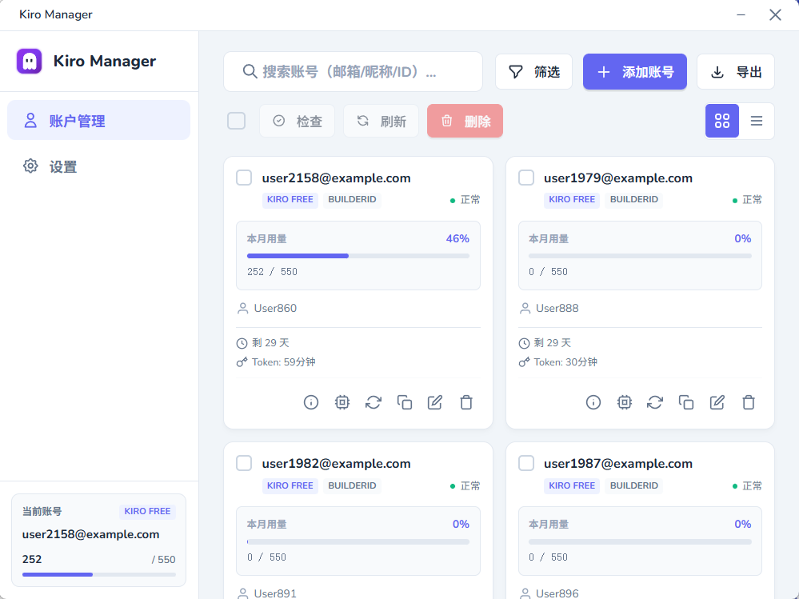
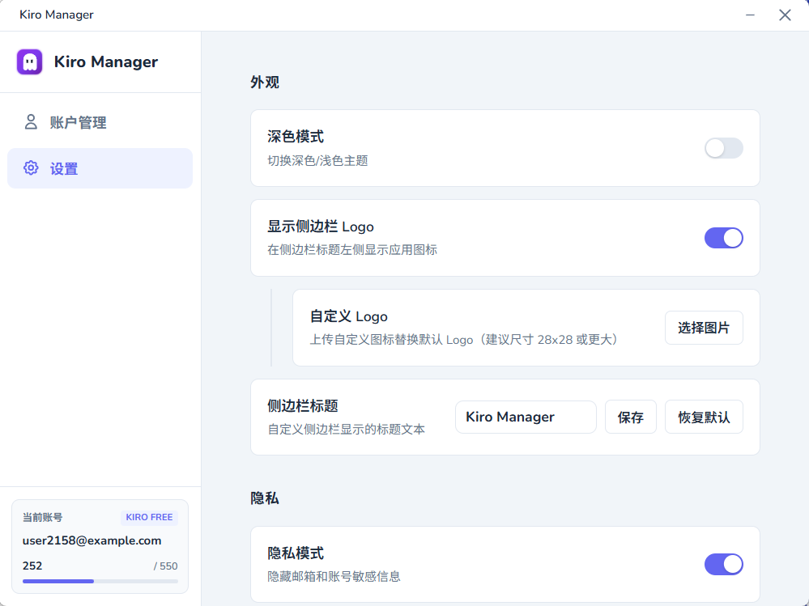

# Kiro Manager

<div align="center">
  
  <p>一个现代化的 Kiro 账号管理工具</p>
  
  [](https://github.com/huey1in/kiro-manager)
  [](https://github.com/huey1in/kiro-manager)
  [](https://github.com/huey1in/kiro-manager/releases)
  [](LICENSE)
</div>

## 界面预览

<table>
  <tr>
    <td width="50%">
      <h3 align="center">账号卡片视图</h3>
      
    </td>
    <td width="50%">
      <h3 align="center">账号列表视图</h3>
      
    </td>
  </tr>
  <tr>
    <td width="50%">
      <h3 align="center">设置页面</h3>
      
    </td>
    <td width="50%">
      <h3 align="center">暗色主题</h3>
      
    </td>
  </tr>
</table>

## 功能特性

### 账号管理
- 支持单个和批量导入账号
- 自动验证 OIDC 凭证
- 实时显示账号状态（正常、已封禁、已过期等）
- 查看账号可用模型列表
- 账号使用量和订阅信息展示

### 自动化功能
- Token 自动刷新
- 账号信息自动同步
- 可配置的检查间隔

## 下载安装

前往 [Releases](https://github.com/huey1in/kiro-manager/releases) 页面下载最新版本的安装包。


## 技术栈

- **前端框架**：TypeScript + Vite
- **桌面框架**：Tauri 2.0
- **后端语言**：Rust
- **UI 样式**：原生 CSS

## 开发

### 环境要求

- Node.js 20+
- Rust 1.70+
- Windows 10/11

### 安装依赖

```bash
npm install
```

### 开发模式

```bash
npm run tauri dev
```

### 构建应用

```bash
npm run tauri build
```


## 许可证

MIT License

## 贡献

欢迎提交 Issue 和 Pull Request！

## Star History

[](https://star-history.com/#huey1in/kiro-manager&Date)

## 免责声明

本工具仅供学习和个人使用，请遵守 Kiro 服务条款。
